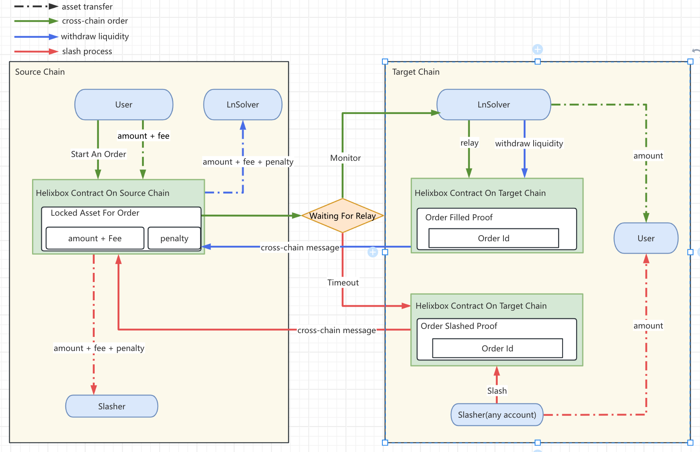

# Protocol v3

## Overview

In the v2 version of the Liquidity Node Protocol, we have implemented a collateral mechanism to protect user assets. In this v2 protocol, the amount of collateral staked by the LnSolver determines the transfer limit for a single transaction in that direction. To enhance trading depth, LnSolvers must stake more collateral. However, since collateral cannot be shared across different directions, this leads to increased collateral costs. Consequently, the v2 protocol is more suitable for frequent, small-value transactions.

To address this issue, we are introducing a new protocol version, v3, which eliminates the requirement for collateral staking. When registering, LnSolvers will only need to stake a modest penalty reserve amount. This reserve ensures the timely completion of message delivery by the LnSolver and imposes penalties if expectations are not met.

## Security Assumptions

1. We make the assumption that there exists a secure and reliable general-purpose messaging channel for communication from the target chain to the source chain. This assumption ensures the reliable transmission of messages from the target chain to the source chain.
2. We assume that both the source chain and the target chain's blocks are synchronized with the same world clock. This assumption allows for consistent timestamping and the handling of time-sensitive events across both chains.

## Interactions

The diagram below illustrates three different flows in HelixBridge Lnv3, along with the asset transfer paths involved:

* [Green Line] The standard cross-chain process, where the user starts an order → the MM completes the order.
* [Red Line] An exception case, where the user starts an order → order timeout → the slasher completes the order and earns a reward.
* [Blue Line] The MM claims the locked liquidity assets.

### LnSolver Registration

The LnSolver stores its configuration information on the source chain and stakes a specific amount of penalty reserve, which can be shared across different paths.

1. Select the supported source chain, target chain, and token. Register the LnSolver and configure transaction fees and transfer limits accordingly.

2. Deposit the penalty reserve on the source chain.

3. Run the relayer client.

### Cross-Chain Transfer by Users

1. A user choose the direction for cross-chain token transfer and specify the LnSolver to initiate the transaction on the source chain.

2. The user lock tokens, fees, and a single LnSolver penalty collateral on the source chain.

3. The user waits to see the tokens arrive in his/her account on the target chain.

   Once the LnSolver sees the transfer event, it transfers the tokens to the user-specified account on the target chain and generates a transfer proof at the same time.

### Slash

If the LnSolver did not complete the transfer within a specified timeout, the Slasher on the target chain transfers tokens to the user and sends a reverse message to the source chain, extracting the locked assets as per the second step.

A Slasher does not need to register. Any account including the user themselves is considered a Slasher as long as it completes the this.

Slashers play a crucial role throughout the entire cross-chain transaction cycle and assists in finalizing transactions when LnSolver is not functioning. The slasher not only receives the equivalent assets transferred to the user but also earns the fees and the LnSolver's penalty collateral, completing the transaction loop.

### Liquidity Withdrawal by LnSolver

After a regular transaction is successfully completed, the liquidity for each transaction remains locked within the source chain.

To withdraw this liquidity, LnSolver must send a cross-chain message from the target chain to the source chain. LnSolver has the option to withdraw liquidity from multiple transactions simultaneously, which can notably reduce cross-chain messaging gas fees.

> However, accumulating too many transactions may lead to the liquidity over-occupation, thereby weakening the LnSolver's liquidity capabilities. Therefore, LnSolver must carefully determine the number of transactions to batch withdraw liquidity from.
