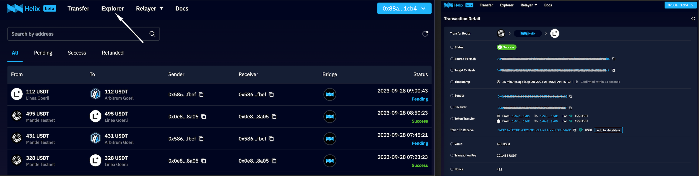

# Transfer

## Steps

- Visit Helixbox LnBridge at [mainnet](https://bridge.helix.box/) or [testnet](https://helix-stg-test.vercel.app/).
- Select source chain, target chain and token you want to transfer.
- Switch wallet to the source chain and connect wallet.
- Fill the transfer amount, and then you can find the transfer information include fee, estimated time if there are bridges avaliable.
- Click `Transfer` and you will receive a popup for transfer confirmation. Then click `Confirm` after every detail is checked.
- Then you will be prompted to confirm the transaction in your wallet. After confirming in your wallet, you have submitted the transaction. You can track the transfer progress by clicking on the `transaction history` in the pop-up window.
- All the transfer histories can be found in `Explorer`, and you can filter the history by account address or transaction hash. Click the record, you can see the detail of the transfer.


## Attention

There may be multiple bridges for the same transfer path, and Helixbox selects one by default for the user, but the user is free to choose which bridge to use to complete the cross-chain in order to ensure that the costs and efficiency of the transfer are reasonable.

Once the transfer is submitted, it cannot be canceled, please double check the amount, target chain and other information before initiating the cross-chain transfer from your wallet.

The costs, arrival times, caps, etc. given in the hints are all estimates, and there will be some error between them and the actual values.


## Fee

The fee structure consists of two components: a base fee to cover the gas fees incurred by the LnProvider when executing transactions on the target chain and a liquidity fee designed to compensate the LnProvider for the loss of liquidity.

* Base Fee

   The base fee is determined and set by the LnProvider, remaining a fixed value until the LnProvider updates it. Users are required to pay this fee to the LnProvider at the time they initiate the transfer.

* Liquidity Fee

   Similar to the base fee, the liquidity fee is also determined by the LnProvider. However, this fee is directly related to the amount of the transfer initiated by the user. As the transfer amount increases, the corresponding fee also increases.

Assuming the user's transfer quantity is denoted as "Amount," the base fee as "BaseFee," and the liquidity rate as "LiquidityRate," then the total fee for the transfer can be calculated as follows:

```
TotalFee = BaseFee + Amount * LiquidityRate
```

It's important to note that these fees are separate from the actual transfer and need to be accounted for by users. Users should set aside a portion of the token to cover the cross-chain fees. LnProvider registration is permission-less, and their fee is freely configurable. Helixbox's backend system will gather information from various LnProviders and choose the most suitable one for users based on their preferences. For instance, an LnProvider with a lower fee will have a higher chance of being recommended by the system.
