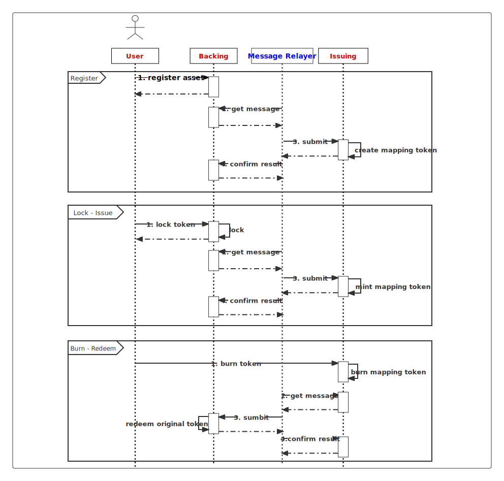

# XToken

XToken is crucial to Helix's Bridge as a Service (BaaS) by offering a framework and service for custodian dapps or token owners to create bridges across different chains. It utilizes the Cryptocurrency Backed Asset (CBA) model to map tokens, ensuring a reliable issuance and redemption process during bridging.

## Terms

- **Source Chain And Target Chain**

  Refers to the source blockchain network and the target blockchain network for cross-chain asset transfers via a bridge, respectively. Alternatively, it can denote the caller and the callee of a remote chain call. Generally, a light client of the source chain needs to be established on the target chain to perform cross-chain verification of messages or events from the source chain.

- **Original Token and Mapping Token**

  This is a pair of relative terms. The original token typically refers to assets that have not been bridged to the target chain, such as BTC on the Bitcoin network, ETH, or USDT on the Ethereum network. On the other hand, the original token is located on the source chain of the bridge, while the mapping token is situated on the target chain of the bridge. The mapping token is a type of asset created with the backing of the original token.

- **Relayer**

  Relayers are a group of competing and supervising entities responsible for maintaining and executing the bridge's information relaying tasks. While relayers may not significantly impact the safety of a bridge, they play a direct role in ensuring the liveness and effectiveness of the bridge.

## CBA Model

The CBA Model involves deploying the Backing module on the source chain and the Issuing module on the target chain. The asset registration and issuance process is completed through underlying calls to the generic cross-chain messaging channel.

- **Backing**

  Deployed on the source chain, the Backing module locks user tokens. Backing generates locking proofs, and the tokens are held in Backing as collateral for asset issuance mapping on the target chain. These tokens remain locked until a user initiates a reverse redemption operation, at which point they are unlocked and returned to the user's account.

- **Issuing**

  Deployed on the target chain, the Issuing module is backed by the original token in the locking model. Issuing issues mapping tokens to the user's account. When a user initiates a redemption operation, Issuing burns the mapping token and generates a proof of destruction for the original token redemption.

## Protocol

- **Asset registration**

  Asset registration is the process of registering the original token with the Backing module on the source chain and mapping it to the corresponding mapping token on the target chain. This involves calling the Backing module to provide meta information about the original token, and the message relayer relays this information to the Issuing module on the target chain to create the corresponding mapping token.

- **Tokens Locking and Issuance**

  After completing asset registration, users can lock the original tokens through the Backing module. Once the Message Relayer synchronizes the locking message to the target chain, the Issuing module mints the same amount of mapping tokens to the user's specified account.

- **Operations After Issuance**

  On the target chain, mapping tokens adhere to the same token standard as original tokens, allowing users to execute various types of operations such as swapping and transferring.

- **Tokens Burning and Redemption**

  Users holding mapping tokens on the target chain can burn them by calling the Issuing module. The Message Relayer delivers the burning message to the source chain, and then the Backing module unlocks the original token, transferring it to the user's specified account.

## Transaction Atomicity

  The issuance or redemption process can be treated as a transaction. For example, when a user initiates a `lockAndXIssue` operation on the source chain, the protocol generates an global unique ID to track this transaction. Similarly, on the target chain, a status tracks the transaction's state, including `TRANSFER_UNFILLED`, `TRANSFER_DELIVERED`, or `TRANSFER_REFUNDED`. This procedure is analogous for the `burnAndXUnlock` operation, but we will focus on `lockAndXIssue` to illustrate how transactions are resolved under various circumstances.
  
  If the issuance of mapped tokens on the target chain is successful, the transaction status updates to `TRANSFER_DELIVERED` and the process concludes.
  
  However, if there are issues in the messaging layer such as undelivered messages, delivery failures, or significant delays, leaving the status at `TRANSFER_UNFILLED`, the user can initiate a rollback through the xRollbackLockAndXIssue operation on the target chain. This marks the status as `TRANSFER_REFUNDED` and triggers a message to the source chain to process an asset rollback and finalize the transaction.
  
  This streamlined approach reduces our dependency on the responsiveness of the cross-chain messaging service, enables compatibility with more messaging services, and lowers operational costs. It does, however, require an additional refund operation in cases of failure, ensuring transaction integrity and user confidence.
